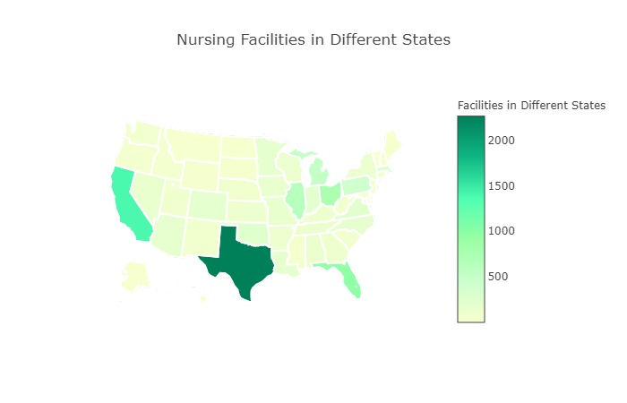
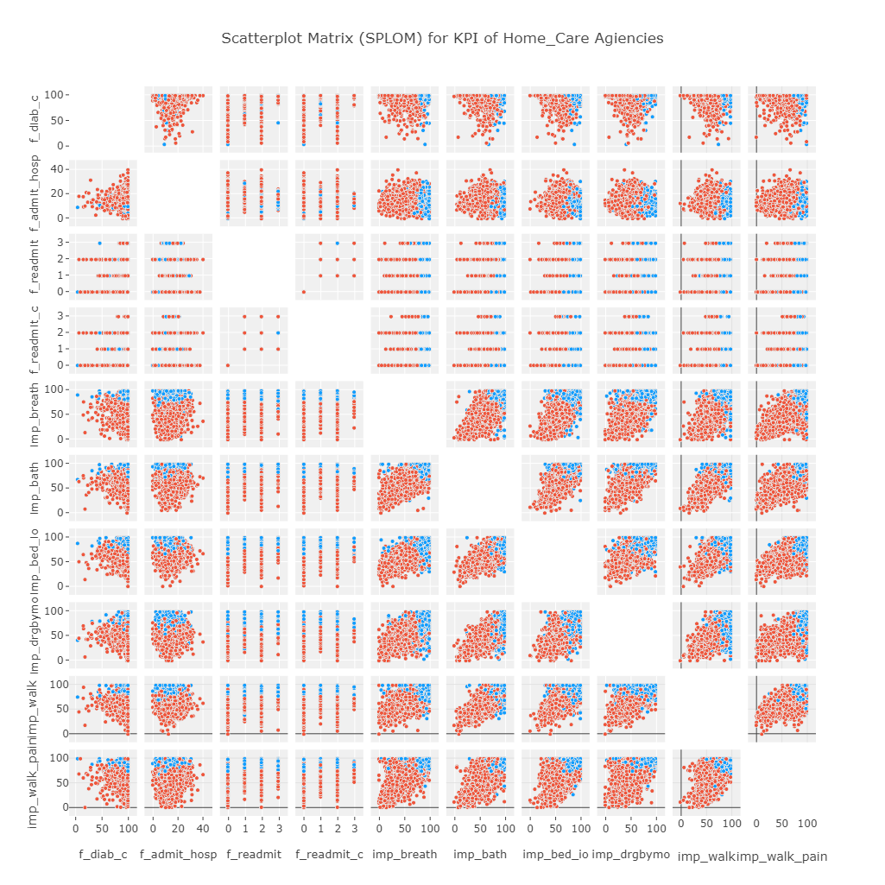

***MDS Quality Measures | Nursing-Home-KPI-comparision***

SOURCE: https://data.medicare.gov/Home-Health-Compare/Home-Health-Care-National-Data/97z8-de96

**ABOUT DATA-SET:**

*Description*

Quality measures displayed on Nursing Home Compare that are based on the resident assessments that make up the nursing home Minimum Data 
Set (MDS). Each row contains a specific quality measure for a specific nursing home and includes the 4-quarter score average and scores 
for each individual quarter.

A list of all Home Health Agencies that have been registered with Medicare. The list includes addresses, phone numbers, and
national averages for critical quality measures of each Home Health Agencies.

*What's in this Dataset?*
---
Rows: 11.4K
Columns: 63
---

*Coulmn Decription*
Of 63 columns, many features included primary information about facilities like address, zip and performance parameter and its footnote
explaining the paramter.

1.	address
2.	city
3.	date_certified
4.	how_much_medicare_spends_on_an_episode_of_care_at_this_agency_compared_to_medicare_spending_across_1
5.	how_often_home_health_patients_had_to_be_admitted_to_the_hospital
6.	how_often_home_health_patients_who_have_had_a_recent_hospital_stay_had_to_be_re_admitted_to_the_ho_1
7.	how_often_home_health_patients_who_have_had_a_recent_hospital_stay_received_care_in_the_hospital_e_1
8.	how_often_patients_breathing_improved
9.	how_often_patients_developed_new_or_worsened_pressure_ulcers_patient_care_star_rating
.
.
.
36.	state
37.	type_of_ownership
38.	with_diabetes_how_often_the_home_health_team_got_doctor_s_orders_gave_foot_care_and_taught_patient_1
39.	zip
.
.

**AIM OF PROJECT**

To identify Key Performance Paramenters of Nursing and to study how each nursing home perform on each KPI using Exploratory Data Analysis.

**PROJECT FLOW**

1. Extract data from https://data.medicare.gov/Nursing-Home-Compare/MDS-Quality-Measures/djen-97ju using SoQl
2. Clean Data- set: Identified and removed redundant data point and columns
3. Transform- Restructed column positions and normalized data-set
4. Finalized KPI-dataset
5. Removed columns with high value points for ease of visualization
6. Performed Exploratory Data Analysis and gathered insights as follows:

*MAP OF COUNT DITRIBUTION OF FACILITIES ACROSS USA*

>>Intreactive Plot<< is available here https://plot.ly/~adas4/1/

*GRAPH TO VISUALIZE DEPENDENCIES OF MULITPLE KPIs WITH RESPECT TO EACH OTHER

>>Interactive Plot<< is available here https://plot.ly/~adas4/3/

Interesting insight- although many KPIs show positive correlation with each other, there are few KPIs like resident frequency to go to hospital shows negative correlation with rest of KPIs--- which is desirable-- if not the case then so then it might indicative of poor care.

Detailed coding and insights are presented in file here https://github.com/singh-sona/Nursing-Home-KPI-comparision/blob/master/Nursing_Home%20Comparison.ipynb

